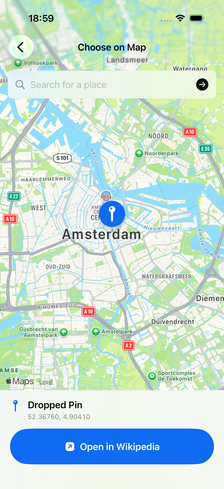
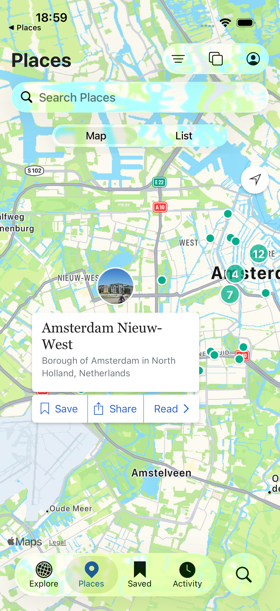

# Wikipedia Places

An iOS deep-linking demo composed of two apps:

- A modified build of Wikipedia for iOS that accepts a coordinate and opens the Places tab at that location.
- Places, a SwiftUI companion app for browsing a remote location feed, choosing a point on Apple Maps, or opening one of 20 unusual destinations.

The complete flow is available as a [short simulator recording](docs/places-to-wikipedia.mp4).

## Screenshots

| Location feed | Choose on map | Suggestions | Wikipedia Places |
| --- | --- | --- | --- |
|  |  |  |  |

## Requirements

- macOS with Xcode 16 or later; verified with Xcode 26.4
- An iOS 17.6+ simulator or device
- [Homebrew](https://brew.sh)
- [XcodeGen](https://github.com/yonaskolb/XcodeGen) 2.45+
- [SwiftGen](https://github.com/SwiftGen/SwiftGen) 6.6+

Install the tools used by Places:

```sh
brew install xcodegen swiftgen
```

## XcodeGen

The Places Xcode project is generated with XcodeGen and is not committed to the repository. Generate `PlacesLauncher.xcodeproj` locally before opening, building, or testing the app:

```sh
cd PlacesLauncher
xcodegen generate
open PlacesLauncher.xcodeproj
```

[`PlacesLauncher/project.yml`](PlacesLauncher/project.yml) is the source of truth. Run `xcodegen generate` again after changing project settings, targets, dependencies, or source layout.

## Run Both Apps

Install and launch the modified Wikipedia app first. Both apps must run on the same simulator or device.

### 1. Wikipedia

```sh
cd wikipedia-ios
./scripts/setup_bundle_id ci
open Wikipedia.xcodeproj
```

In Xcode, select the `Wikipedia` scheme, choose an iOS 17.6+ destination, and run the app once. Complete or skip onboarding so the app is ready to receive links.

The upstream `./scripts/setup` script can be used instead when the full Wikipedia development toolchain is not already installed.

### 2. Places

```sh
cd PlacesLauncher
./scripts/generate-localizations.sh
xcodegen generate
open PlacesLauncher.xcodeproj
```

Select the `PlacesLauncher` scheme, choose the same destination used for Wikipedia, and run. The generated Xcode project is intentionally ignored; [`project.yml`](PlacesLauncher/project.yml) is the source of truth.

### 3. Try the handoff

Open any destination from one of the three entry points:

- **From the feed** fetches the public location catalog and opens the selected result.
- **Choose on map** searches Apple Maps or uses the center pin after panning.
- **Bonus map** loads 20 bundled suggestions and switches to a retro map-inspired interface.

Accept iOS's confirmation the first time Places opens Wikipedia. Wikipedia will select its Places tab and center it on the requested coordinate instead of the device's current location.

## Deep Link

The modified Wikipedia app supports:

```text
wikipedia://places?lat=<latitude>&lon=<longitude>
```

For example:

```text
wikipedia://places?lat=37.33489&lon=-122.00899
```

`lat` and `lon` must be finite coordinates within the standard latitude and longitude ranges. The parser also accepts `long` as a longitude alias. Invalid or incomplete links are ignored without changing the selected tab.

To test the URL directly in a booted simulator:

```sh
xcrun simctl openurl booted \
  'wikipedia://places?lat=37.33489&lon=-122.00899'
```

## Places App

Places is built with SwiftUI and a feature-based MVVM architecture:

- iOS 17 `@Observable` view models depend only on use-case protocols.
- Use cases coordinate feed loading, bundled suggestions, map search, and location confirmation.
- `DefaultLocationsProvider` owns both remote feed and local catalog access.
- Codable DTOs and explicit mappers isolate transport data from domain models.
- FactoryKit provides dependency injection while each view model exposes a static production factory.
- Swift Concurrency drives network loading, cancellation, retry, and MapKit search.
- English and Spanish strings are generated into a type-safe `L10n` enum by SwiftGen.

The feed is requested when its screen appears from:

```text
https://raw.githubusercontent.com/abnamrocoesd/assignment-ios/main/locations.json
```

Networking uses a generic Codable HTTP client backed by `URLSession`. Request method and cache policy are explicit in `HTTPEndpoint`, and the feed currently follows standard HTTP caching through `.useProtocolCachePolicy`.

Accessibility support includes semantic labels and hints, grouped card content, button traits, loading announcements, Dynamic Type-friendly layouts, and reduced-motion handling for animation.

## Project Structure

```text
.
├── PlacesLauncher/       SwiftUI companion app, tests, and XcodeGen spec
├── wikipedia-ios/        Modified Wikipedia iOS source and focused tests
├── docs/                 Design notes, screenshots, and demo recording
└── PLAN.md               Implementation history and deliverables
```

The Places app keeps the generated project out of source control. After changing `project.yml`, regenerate it with `xcodegen generate`. After changing localized strings, run `./scripts/generate-localizations.sh`; Xcode also runs this generator before app builds.

## Tests

Generate the Places project before running its tests:

```sh
cd PlacesLauncher
./scripts/generate-localizations.sh
xcodegen generate

xcodebuild test \
  -project PlacesLauncher.xcodeproj \
  -scheme PlacesLauncher \
  -destination 'platform=iOS Simulator,name=iPhone 17 Pro' \
  -only-testing:PlacesLauncherTests \
  -testLanguage en \
  CODE_SIGNING_ALLOWED=NO
```

Run the focused Wikipedia deep-link tests from `wikipedia-ios`:

```sh
xcodebuild test \
  -project Wikipedia.xcodeproj \
  -scheme Wikipedia \
  -destination 'platform=iOS Simulator,name=iPhone 17 Pro' \
  -only-testing:WikipediaUnitTests/PlacesDeepLinkTests \
  -testLanguage en \
  CODE_SIGNING_ALLOWED=NO
```

The Places UI test suite includes a real cross-app handoff. Install the modified Wikipedia build on the selected simulator before running:

```sh
cd PlacesLauncher
xcodebuild test \
  -project PlacesLauncher.xcodeproj \
  -scheme PlacesLauncher \
  -destination 'platform=iOS Simulator,name=iPhone 17 Pro' \
  -only-testing:PlacesLauncherUITests \
  -testLanguage en \
  CODE_SIGNING_ALLOWED=NO
```

## Attribution and License

`wikipedia-ios/` is derived from the [Wikimedia Foundation's Wikipedia iOS project](https://github.com/wikimedia/wikipedia-ios) and retains its [MIT license](wikipedia-ios/LICENSE.txt). No separate root license has been selected for the original Places code in this repository.
