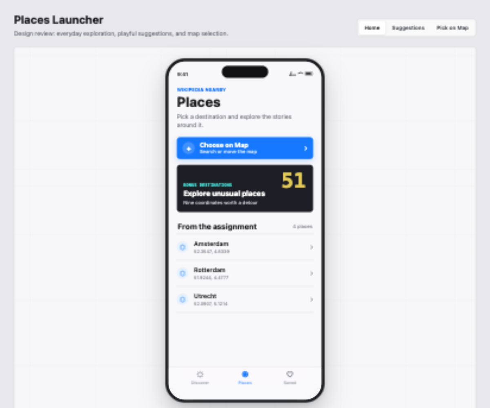
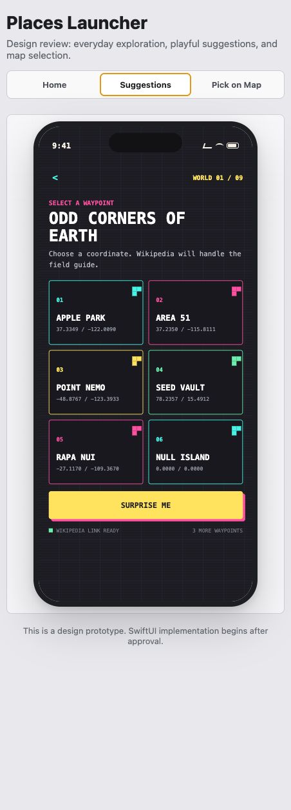
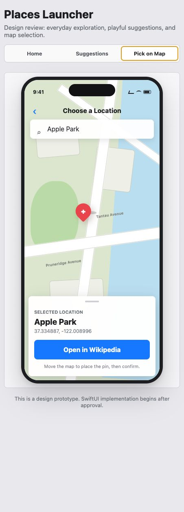

# Places Launcher Design Direction

Status: Awaiting Arturo's approval before SwiftUI implementation.

Interactive preview: [design-preview.html](./design-preview.html)

## Preview Screens

### Home

### Suggestions

### Pick on Map

## Product Character

The launcher has two visual personalities with a deliberate boundary between them:

- **Everyday mode** uses a polished Apple-style language: quiet surfaces, clear hierarchy, native-feeling controls, generous spacing, and restrained color.
- **Suggestions mode** feels like entering a retro exploration game: pixel-inspired type, a map grid, brighter cyan/magenta/yellow accents, destination coordinates, and playful status copy.

Suggestions is visible from the main screen. It is not unlocked by a code. Opening it changes the entire presentation; using Back restores the everyday mode.

## Primary Flow

1. The app opens on **Places**, showing locations from the assignment feed.
2. Tapping a feed location immediately opens Wikipedia through the Places deep link.
3. Tapping **Explore unusual places** opens the retro Suggestions screen.
4. Tapping a suggestion opens Wikipedia at that coordinate.
5. Tapping **Choose on Map** opens the custom-location flow.
6. The user searches for a place or pans the map, then confirms the map-center coordinate.
7. Confirming opens Wikipedia at the selected coordinate.

## Screen Notes

### Home

- Large but compact `Places` title with an exploration subtitle.
- A visible custom-location command near the top.
- A featured Suggestions entry with a small preview of the retro palette.
- Feed results use unframed rows with a location icon, name, coordinates, and disclosure indicator.
- The current assignment feed remains the dominant content.

### Suggestions

- Dark ink background with a subtle square map grid.
- Monospaced, pixel-inspired display treatment without sacrificing legibility.
- Cyan, magenta, yellow, and mint accents distinguish destinations.
- Suggestions are visible destination tiles, not hidden easter eggs.
- Back is always obvious and returns the app to its normal style.
- Initial candidates: Apple Park, Area 51, CERN, Rapa Nui, Svalbard Seed Vault, Point Nemo, Null Island, Bermuda Triangle, and Darvaza gas crater.

### Pick on Map

- Search field at the top accepts a place name rather than raw coordinates.
- Search geocodes the text and repositions the map.
- A fixed center pin makes the selected coordinate predictable while the map moves beneath it.
- A bottom confirmation sheet shows a resolved title and coordinates.
- Confirm is the primary action; cancel/back is always available.
- This flow is the final implementation phase because it adds map interaction and geocoding behavior.

## Accessibility

- All destination rows expose the location name and coordinates as one VoiceOver element.
- Decorative map and pixel effects are hidden from assistive technologies.
- Suggestions colors are never the only way destinations are distinguished.
- Dynamic Type may wrap labels and coordinates without truncating required information.
- Touch targets are at least 44 by 44 points.
- Reduce Motion removes screen-transform effects while preserving the mode change.
- The map pin announces that the coordinate at the center will be selected.
- Search, geocoding failures, loading, and confirmation updates are announced appropriately.

## Motion

- Home to Suggestions: quick color and typography transition with a restrained map-grid reveal.
- Suggestions to Home: standard back navigation restores the normal appearance immediately.
- Map confirmation sheet follows native spring timing.
- No essential information depends on animation.

## Approval Gate

SwiftUI implementation starts only after Arturo approves:

- The everyday Home direction.
- The full-screen retro Suggestions transformation.
- The Apple Maps selection flow.
